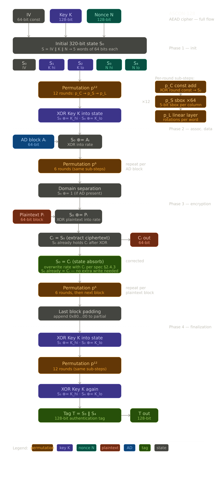

# ascon-128
Ascon-AEAD128 is a lightweight authenticated-encryption algorithm standardized by NIST in **SP 800-232 (final, August 2025)**. It uses a 128-bit key, a 128-bit nonce, a 128-bit rate, a 128-bit authentication tag, and a 320-bit internal permutation state.

Ascon-AEAD128 is based on a sponge-like construction rather than a conventional block cipher. The parameters implemented by this repository are:

• Key Length (k): 128 bits
• Nonce Length: 128 bits
• Rate or Block Size (r): 128 bits
• Number of rounds (a, b): 12 and 8 rounds respectively
• Authentication Tag Length: 128 bits

---

## Features

- Ascon-AEAD128 implementation compliant with NIST SP 800-232
- 320-bit permutation state
- 12-round (`P12`) initialization/finalization and 8-round (`P8`) processing support
- Hardware 10* padding for final associated-data and plaintext blocks
- Hardware masking of partial final ciphertext blocks
- FSM-based controller
- Datapath/controller separation
- SystemVerilog RTL implementation
- Python reference/golden model
- Vivado/XSim simulation support

The current implementation targets **Ascon-AEAD128 from the final NIST SP 800-232 specification**, rather than the older Ascon submission/v1.2 parameter set.
---

## Architecture

The design is divided into two major blocks:

- **Controller (FSM)**
  - Controls initialization
  - Associated-data absorption
  - Plaintext absorption
  - Finalization
  - Selects P8/P12 permutations
  - Tracks the final associated-data and plaintext blocks

---

- **Datapath**
  - 320-bit Ascon state
  - Round permutation engine
  - Key/nonce loading
  - Hardware 10* padding
  - Partial-block ciphertext masking
  - Ciphertext generation
  - Authentication-tag generation

The RTL accepts raw, unpadded data blocks. The caller supplies the number of valid bytes in the final block through `data_bytes`; the hardware inserts the `0x01` padding byte and zeroes the remaining bytes. For messages whose length is an exact multiple of 16 bytes, an additional final padding block is required.

---

## Block Diagram



---

## Verification

A Python reference implementation is included alongside the RTL to verify the Ascon-AEAD128 initialization, permutation, associated-data processing, plaintext processing, ciphertext, and authentication tag.

The repository also includes:

- A SystemVerilog simulation testbench in `tb/ascon_tb.sv`
- A reference KAT file in `docs/ascon128_kat.txt`
- A sample waveform in `docs/waveform.png`

The supplied testbench currently runs a manually configured test vector and prints the resulting ciphertext and tag for comparison with the Python reference model. It is not yet an automated self-checking KAT testbench.

---

## Development Environment

- SystemVerilog RTL
- AMD Vivado with XSim
- Python 3 reference model
- Any simulator supporting the SystemVerilog constructs used by the testbench

To run the Python reference model:

```bash
python3 py/ascon_py.py
```

The RTL testbench can be run by adding the files in `rtl/` and `tb/ascon_tb.sv` to a Vivado/XSim simulation project. Configure the test vector in the `EDIT ME` section of `tb/ascon_tb.sv` before starting the simulation.

---

## References

- NIST SP 800-232, *Ascon-Based Lightweight Cryptography Standards for Constrained Devices* (final, August 2025)
- Official Ascon-AEAD128 specification and Known Answer Tests
- Ascon permutation specification

---

## License

This project is released under the MIT License.

---

## Author

Personal cryptographic hardware accelerator by vijoshy
